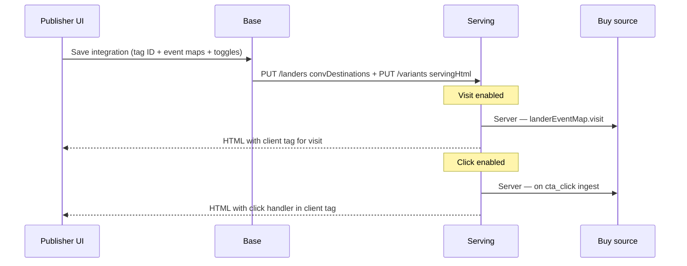

# Nexus Buy-Source Event Tracking

> **Scope:** Extends [Nexus Conversion Destinations](nexus-conversion-destinations.md) with **Lander-level events** (visit, impression, click) fired to buy sources (Meta, Google Ads, Taboola). **Advertiser-level events** (postback conversions) remain as documented in the conversion-destinations doc. **Client-side vs server-side execution is hidden from publishers** — one toggle per event controls both paths.

**Related:**
- [Nexus Conversion Destinations](nexus-conversion-destinations.md) — `convDestinations`, `visitBuyAttribution`, postback dispatch
- [Workspace Integrations](../02-base-system/workspace-integrations.md) — integration catalog, publish Tracking
- [Metric Collection](../05-metric-collection/metric-collection.md) — Nexus internal metrics pipeline

---

## 1. Purpose

Publishers connect buy-source integrations once per workspace and choose which events fire to Meta / Google / Taboola. They provide **tracking tag IDs** (e.g. Google `AW-…`, Meta Pixel ID) and **event name mappings**. Nexus fires each enabled event via:

1. **Client** — baked tag snippet in `servingHtml` (`gtag`, `fbq`, Taboola pixel)
2. **Server** — buy-source API dispatch from Serving (CAPI, Google Data Manager upload, Taboola S2S)

If the user disables **click** for a lander, Nexus disables **both** client and server click firing for that lander. No separate “client vs server” UI.

---

## 2. Event taxonomy

| UI name | Wire key | Nexus metric source | When it fires |
|---------|----------|---------------------|---------------|
| **Visit** | `visit` | `visit_served` | Serving returns HTML (page load) |
| **Impression** | `impression` | `impression` | Browser page-render beacon |
| **Click** | `click` | `cta_click` | Browser CTA click beacon |

**Advertiser-level events** use postback `conversion_type` as the key (`lead`, `purchase`, …) — unchanged from conversion destinations.

---

## 3. Default platform event names

Publishers may override `eventName` per row. Defaults:

| Nexus event | Meta (`buySource: fb`) | Google Ads | Taboola |
|-------------|------------------------|------------|---------|
| `visit` | `PageView` | `page_view` | `page_view` |
| `impression` | `ViewContent` | `view_content` | `view_content` |
| `click` | `InitiateCheckout` | `cta_click` | `cta_click` |
| `lead` (postback) | `Lead` | `lead_offline` | `lead` |
| `purchase` (postback) | `Purchase` | `purchase_offline` | `purchase` |

**Product rule:** `impression` is **disabled by default** when `visit` is enabled (avoids double page-view on buy sources).

---

## 4. Config shape (Base → Serving)

### 4.1 Workspace integration (`kind: buy_source`)

```json
{
  "integrationId": "int_google_01",
  "provider": "google_ads",
  "kind": "buy_source",
  "config": {
    "customerId": "4174746211",
    "tagId": "AW-123456789",
    "accessToken": "1//…",
    "landerEventMap": {
      "visit":      { "enabled": true,  "eventName": "page_view" },
      "impression": { "enabled": false, "eventName": "view_content" },
      "click":      { "enabled": true,  "eventName": "cta_click" }
    },
    "advertiserEventMap": {
      "lead":     { "eventName": "Submit lead form", "conversionActionId": "8841502", "value": 40, "currency": "USD" },
      "purchase": { "eventName": "purchase_offline", "conversionActionId": "8841503" }
    }
  }
}
```

**Deprecated alias:** `eventMap` → `advertiserEventMap` (postback only). New integrations use split maps.

### 4.2 Serving `convDestinations[]` element (synced)

Server dispatch reads from flattened sync (secrets + maps only — no client tag bake):

```json
{
  "convDestinationId": "int_google_01",
  "buySource": "google",
  "customerId": "4174746211",
  "tagId": "AW-123456789",
  "accessToken": "1//…",
  "landerEventMap": { "visit": { "enabled": true, "eventName": "page_view" }, "click": { "enabled": true, "eventName": "cta_click" } },
  "advertiserEventMap": { "lead": { "eventName": "Submit lead form", "conversionActionId": "8841502", "value": 40, "currency": "USD" } }
}
```

### 4.3 Lander override (optional)

```json
{
  "selectedIntegrationIds": { "google_ads": "int_google_01" },
  "landerEventOverrides": {
    "google_ads": {
      "visit": { "enabled": true },
      "impression": { "enabled": false },
      "click": { "enabled": false }
    }
  }
}
```

Empty override → inherit workspace `landerEventMap` enabled flags.

---

## 5. Execution model (hidden from UI)



| Enabled? | Client (baked HTML) | Server (API) |
|----------|---------------------|--------------|
| Visit on | `gtag` / `fbq` page event on load | Dispatch on `visit_served` |
| Impression on | Beacon hook or tag event | Dispatch on `nexus.raw.impressions` consumer |
| Click on | CTA onclick + `event_callback` | Dispatch on `nexus.raw.clicks` consumer |
| Visit off | No visit snippet | No server visit dispatch |
| Click off | No click handler | No server click dispatch |

**Dedup:** `event_id` / `transaction_id` = `{visit_id}`, `{visit_id}:impression`, `{visit_id}:{cta_id}`.

---

## 6. System responsibilities

### 6.1 Generation System

| Change | Detail |
|--------|--------|
| **No integration config** | Generation does not own buy-source credentials (unchanged). |
| **CTA markup** | Generated CTAs should include stable `data-cta-id` (or `id`) so click tracking can attach without GTM. |
| **No tracking scripts in Gen output** | Tracking snippets are injected at **Base bake** on publish, not in GenerationJob HTML. |

### 6.2 Base System

| Area | Change |
|------|--------|
| **WorkspaceIntegration** | Add `landerEventMap`, rename/clarify `advertiserEventMap`; add `tagId` (Google `AW-…`), `accountId` (Taboola). |
| **Lander** | Optional `landerEventOverrides` per provider. |
| **Publish bake** | Resolve integration → build **client tag snippet** from `tagId` + enabled `landerEventMap` → inject into each variant `servingHtml`. |
| **Serving sync** | Flatten buy_source row → `convDestinations[]` incl. both maps + secrets (server only). |
| **UI** | Settings → Integrations modal: **Lander-level events** table + **Advertiser-level events** table; no client/server columns. |
| **Publish wizard** | Tracking step: per-lander event toggles (inherit workspace defaults). |
| **Validation** | Block publish if buy-source attached but `tagId`/pixel missing; warn if visit+impression both on. |

### 6.3 Serving System

| Area | Change |
|------|--------|
| **`convDestinations`** | Accept `landerEventMap` + `advertiserEventMap` on lander row. |
| **Visit dispatch** | On `visit_served`, if `landerEventMap.visit.enabled` → fire buy-source adapter. |
| **Impression / click dispatch** | Consumer on raw Kafka topics (or pixel endpoint) → join `visit_id` → dispatch if enabled. |
| **Postback dispatch** | Unchanged — `advertiserEventMap[conversion_type]` (alias `eventMap` during migration). |
| **Routing** | `visitBuyAttribution.buySource` === `convDestination.buySource`. |
| **Consent** | Honour `consent_gdpr` / `consent_ccpa` on `visit_served` before any buy-source fire. |

### 6.4 Metric Collection

| Area | Change |
|--------|--------|
| **Internal pipeline** | Unchanged — `visit_served`, `impression`, `cta_click` still ingest to Kafka/StarRocks. |
| **Optional** | `nexus.raw.buy_source_fires` observability topic (dispatch success/fail). |

### 6.5 Shared UI / Prototype

| Surface | Change |
|---------|--------|
| Settings → Integrations | Split event map; lander events with enable toggles; Google Tag ID field |
| Publish → Tracking | Per-lander visit/impression/click toggles |
| Taboola | Buy-source provider in catalog (`taboola` → `buySource: taboola`) |

---

## 7. Platform adapter notes

### Meta (`fb`)

- **Client:** `fbq('track', eventName, …, { eventID })` baked in HTML.
- **Server:** CAPI — same `eventName`; `event_id` for dedup with browser.
- **Credentials:** `pixelId` + `accessToken` (server); pixel ID only in HTML.

### Google Ads (`google`)

- **Client:** `gtag('event', 'conversion', { send_to: 'AW-XXX/LABEL', transaction_id })`.
- **Server:** Data Manager API `events:ingest` with `conversionActionId` + `gclid` from `clid`.
- **Credentials:** `tagId` (`AW-…`) in HTML; OAuth `accessToken` server-only.

### Taboola (`taboola`)

- **Client:** Optional Taboola pixel base + event calls.
- **Server:** S2S `click-id={clid}&name={eventName}&orderid={event_id}`.
- **Credentials:** `accountId`; event names must match Realize exactly.

---

## 8. GTM / legacy client pixels

- **GTM** (`kind: client_pixel`) remains available but is **not required** for visit/impression/click when buy-source `landerEventMap` is configured.
- Product copy: “Nexus fires lander events to your buy source automatically — no GTM needed for visit, impression, or click.”
- Publishers may still attach GTM for non-Nexus tags; publish should warn on duplicate page-view if GTM + visit both enabled.

---

## 9. Rollout

1. PRD + prototype UI (this doc + nexus-prototype).
2. Base schema + integration editor API (`landerEventMap`, `advertiserEventMap`).
3. Base bake: client tag generation for Meta / Google / Taboola.
4. Serving: visit dispatch on `visit_served`.
5. Serving worker: impression + click dispatch from Kafka.
6. Lander-level overrides in publish API.
7. Optional dispatch observability in Logs UI.

---

## 10. Open questions

- Canonical dedup when client fire succeeds but server fire also runs (always send same `event_id`)?
- Taboola client pixel vs S2S-only v1?
- Per-variant event overrides or lander-level only?

---

## Related documentation

- [Nexus Conversion Destinations](nexus-conversion-destinations.md)
- [Workspace Integrations](../02-base-system/workspace-integrations.md)
- [Metric Collection](../05-metric-collection/metric-collection.md)
- [Serving OpenAPI](openapi.yaml)

[← Conversion Destinations](nexus-conversion-destinations.md) · [Workspace Integrations](../02-base-system/workspace-integrations.md)
