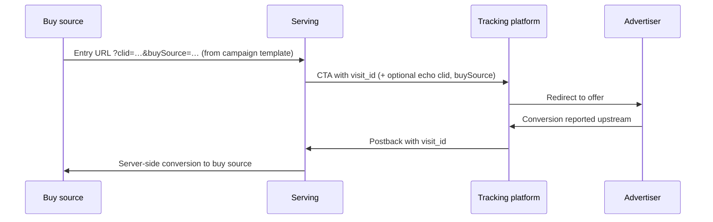

# Nexus Conversion Destinations

## 1. Purpose

Define how Nexus lets teams save **multiple convDestinations per workspace** (each with a **`convDestinationId`**), attach **one or more convDestinations per lander** (e.g. Meta + Google), set workspace **`defaultConvDestinationIds`**, how **Base** resolves static config into **`convDestinations`** on **Serving** lander sync, how **per-visit buy-side attribution** (`clid`, cookies, IP, UA, …) is captured at **`visit_served`** and joined at dispatch by **`visit_id`**, generic **`clid` + `buySource`** on the **entry URL** (buy source → Serving), and how **`conversion_id`** maps to Meta **`event_id`**.

---

## 2. Problem Statement

- Today, conversions can be **ingested** (e.g. MAX → postback endpoint → `nexus.raw.conversions`) and **attributed** in the metric system by joining on `visit_id`.
- **MAX cannot fire a single conversion to both Nexus and the buy-side platform with two different primary IDs:** Nexus attribution is keyed on **`visit_id`**, while buy-side optimization expects a **click id** (`fbclid`, `gclid`, …) and cookie-derived signals; MAX historically supports **one id per conversion** for that fire path, so the partner cannot simultaneously post the same conversion to both systems on **different** unique keys without a **relay** on our side (postback with `visit_id` → we fire CAPI / Google / … using **visit attribution** joined from `visit_served`).
- Publishers need **configurable firing to the buy source** (Meta CAPI first; Google, Taboola, others later) **without** re-entering the same credentials on **every new lander**.
- **Serving** only knows **`landerId` / `variantId`** — not **workspace**. **Base** resolves workspace convDestinations + **`defaultConvDestinationIds`** + lander **`selectedConvDestinationIds`** into **`convDestinations`** (array of static flat objects) and sends it on **`PUT /landers`**. **Per-visit** fields are **not** on the lander row — they come from **`visit_served`** at dispatch time (see §9).

---

## 3. Goals

| ID | Goal |
|----|------|
| G1 | **One or more `convDestinations` per lander** — user attaches convDestinations via **`selectedConvDestinationIds`** (or inherits **`defaultConvDestinationIds`** when empty). **At most one row per `buySource`** on a lander. Publish blocked when policy requires buy-side firing but the resolved list is empty. |
| G2 | **Workspace convDestinations** = reusable saved rows. **Each convDestination = one `convDestinationId` + one scalar `buySource`** (`fb` *or* `google`, …). Meta and Google are **separate convDestinations**. **`defaultConvDestinationIds`** seeds new landers. |
| G3 | On **Base → Serving** sync, Base sends **`convDestinations`**: array of flat objects (one per attached convDestination). Dispatch picks the element where **`visitBuyAttribution.buySource` === element.buySource`**; no match → no fire. |
| G7 | **Buy-side monetary value and currency are not read from the postback.** They are configured once in the convDestination editor (per mapped event or destination-wide constant) and synced to Serving in **`eventMap`**. |
| G6 | The **campaign / lander entry URL** (buy source → Serving) uses generic query params **`clid`** and **`buySource`**; buy-side URL templates expand platform click macros into **`clid`** (see §7.4). Serving reads and persists them on **`visit_served`**. |
| G4 | **Meta CAPI `event_id`** = our **`conversion_id`** assigned at postback ingest (same string on retries for deduplication). See §9.4. |
| G5 | **Core metric ingest** (`nexus.raw.conversions`, Flink enrichment, StarRocks rollups) **unchanged** unless product adds **dispatch observability** (optional; see §11). |

---

## 4. Non-goals (v1)

- Replacing core attribution in StarRocks.
- Changing the rule that **postbacks must carry a resolvable `visit_id`**.
- Exposing **`accessToken`** in lander HTML, public **`GET /landers`** to untrusted clients, or logs (Serving DB/API is trusted; field is server-side only).
- Storing **`fbc` / `fbp` / `clid` / IP / UA** on the lander row (those live on **`visit_served`** only).

---

## 5. Definitions

| Term | Meaning |
|------|---------|
| **Conversion postback** | Server-side call from partner/advertiser pipeline (e.g. MAX) into our ingest endpoint. **Required for dispatch:** `visit_id`, `conversion_type`, timestamp (and idempotency keys). **Not used for buy-side fire:** monetary `value` / `currency` (those come from **`convDestination.eventMap`**). |
| **`conversion_id`** | Unique id **we assign** when the postback is first accepted (ULID or equivalent). Used as idempotency and **as Meta CAPI `event_id`** (see §9.4). |
| **Workspace convDestination** | One saved convDestination in Base = **one scalar `buySource`** (`fb` *or* `google`, …): **`convDestinationId`**, **`convDestinationName`**, platform ids, **`accessToken`**, **`eventMap`**, etc. Many per workspace. |
| **`accessToken`** | Platform API credential (Meta CAPI token, Google OAuth refresh token, …). Stored in **Base DB** for editing; **resolved and synced** on each **`convDestinations`** element at **`PUT /landers`**. Used at dispatch from **C** — no separate token lookup. |
| **`defaultConvDestinationIds`** | **Workspace-level** list of **`convDestinationId`** values — used when a lander’s **`selectedConvDestinationIds`** is empty (e.g. new lander). |
| **`selectedConvDestinationIds`** | **Lander-level** list of convDestinationIds the user attached (e.g. `[dest_meta_01, dest_google_01]`). |
| **`convDestinations`** (synced) | **Static** JSON **array** on the Serving lander (`PUT /landers` / lander row): each element = one resolved flat convDestination (scalar **`buySource`**, **`accessToken`**, platform fields, **`eventMap`**). |
| **`convDestination`** (element) | **One item** inside **`convDestinations`** — same flat shape as a single convDestination. |
| **`visitBuyAttribution`** (not synced) | **Per-visit** buy-side context materialized in **`visit_served`** (and readable at dispatch by **`visit_id`**): generic **`clid`**, **`buySource`**, plus platform-specific fields (`fbc`, `fbp`, `gclid`, `wbraid`, `gbraid`, `clientIpAddress`, `clientUserAgent`, …). **Never** on the lander row. |
| **`clid`** | **Generic click id** on the **entry URL** (`?clid=…`) and in **`visit_served`**: the platform click token for the active buy source. Configured in the buy-source **entry URL** as e.g. `clid={{fbclid}}` (Meta) or `clid={{gclid}}` (Google); Serving reads the resolved query value. Dispatch adapters map **`clid`** to the buy-side API (Meta, Google, …). |
| **`buySource`** | **String** enum: `fb`, `google`, `taboola`, … On **visit** (entry URL) and on each **`convDestination`** element. Dispatch: find lander element where `visitBuyAttribution.buySource` === `element.buySource`. |

---

## 6. End-to-end flow (four parties)

Same four lifelines as a **single** sequence: click path first, then conversion path on the **same** participants (reference style: one diagram, linear time top to bottom).

**Forward:** Buy source → Serving → Tracking platform → Advertiser. **Return:** Advertiser → Tracking platform → Serving → Buy source.

Product-level only: postback ingest, Kafka, and dispatch worker are **collapsed** into **Serving** and **Buy source** arrows.



**Attribution key:** **`visit_id`** remains the join key from postback to `visit_served` (see [design-decisions.md](../01-architecture/design-decisions.md) and [metric-collection.md](../05-metric-collection/metric-collection.md#attribution-model)).

**Implementation note:** **`Trk->>Srv`** is the MAX → Nexus postback; **`Srv->>Buy`** is dispatch (CAPI / Google / …) using **`visitBuyAttribution`** (from **`visit_served`**, keyed by postback **`visit_id`**) **+** the matching item from lander **`convDestinations`**.

---

## 7. Storage and data split (Base vs Serving vs visit)

The old single **`convDestination`** blob mixed **user settings** (set once in the convDestination editor) with **visit/conversion fields** (only known after a click). Those are **three objects** in the product model — **C**, **V**, **P** (see §9 for full shapes):

| Object | When known | Where stored | Who sets it |
|--------|------------|--------------|-------------|
| **`convDestinations` (C)** | Lander publish / convDestination editor | Base workspace convDestinations + lander selection → **`PUT /landers`** → lander **`convDestinations`** (JSON array, incl. **`accessToken`**) | Publisher (workspace admin) |
| **`visitBuyAttribution` (V)** | Each **`visit_served`** | Metric / tracking store (`visit_served` fact); joined at dispatch by **`visit_id`** | Serving at request time + ingest pipeline |
| **Conversion postback (P)** | Each conversion | Postback: `visit_id`, `conversion_type`, timestamp → ingest assigns **`conversion_id`**. No value/currency for buy-side dispatch. | Tracking platform → Nexus postback |

Dispatch merges **C + V + P** at fire time. The publisher **only** configures **C**; **V** is automatic from the click path; **P** arrives on postback.

### 7.1 Base System — convDestinations and lander selection

| Location | What is stored |
|----------|----------------|
| **Workspace — convDestinations** | Many rows; **each row = one scalar `buySource`**. E.g. `dest_meta_01` (`fb`), `dest_google_01` (`google`). **No per-visit fields.** |
| **Workspace — default** | **`defaultConvDestinationIds`**: array of **`convDestinationId`** values (workspace seed for new landers). |
| **Lander (Base)** | **`selectedConvDestinationIds`**: array of convDestinationIds the user attached (e.g. Meta + Google). Empty → inherit **`defaultConvDestinationIds`**. **At most one convDestination per `buySource`** on a lander. Optional per-field overrides on config fields only. **Publish blocked** when policy requires buy-side firing but resolved list is empty. |

On **publish / sync to Serving**, Base resolves each selected id → flat object, applies overrides, builds **`convDestinations`** array, sends on **`PUT /landers`** (see §9.1).

### 7.2 Serving sync

- **`PUT /landers`** / **`GET /landers`** carry **`convDestinations`**: array of flat objects (each: scalar **`buySource`** + **`eventMap`** + **`accessToken`**). Empty array or null = buy-side dispatch disabled for that lander. **Serving has no workspace** tables — lander row is the only config source at dispatch.
- Variants / HTML continue on **`PUT /variants`**; same release window as lander metadata.

### 7.3 Serving database

| Store | Table | Column |
|-------|--------|--------|
| MS SQL (Renderly / A360) | **`dbo.A360_RENDERLY_LANDER`** | **`convDestinations`** — JSON array (camelCase field on lander row); null or `[]` when disabled. |

See [models.md — `A360_RENDERLY_LANDER`](models.md#2-a360_renderly_lander).

### 7.4 Entry URL (buy source → Serving) — generic `clid` and `buySource`

**`clid`** and **`buySource`** are configured on the **campaign / ad entry URL** that sends traffic **into Serving** — not invented only on the outbound CTA to the tracking platform.

Media buyers set the lander route with **generic param names** on the left and **buy-source dynamic macros** on the right (platform-specific expansion at click time):

| Query param | Buy-source template (examples) | Meaning |
|-------------|-------------------------------|---------|
| **`clid`** | `{{fbclid}}` on Meta | One param name; value = platform click id after expansion |
| **`buySource`** | `{{fb}}` | Which buy-side stack this campaign uses |
| **`clid`** | `{{gclid}}` on Google | Same param name; Google expands into `clid` |
| **`buySource`** | `{{google}}` | |

**URL template (Nexus / A360 route macro):**

```
{{route}}?clid={{fbclid}}&buySource={{fb}}
```

**Concrete lander example:**

```
house.bestlivingideas.com/showers-ab?clid={{fbclid}}&buySource={{fb}}
```

**Resolved example (Meta):**

```
https://house.bestlivingideas.com/showers-ab?clid=IwAR0...&buySource=fb
```

**Resolved example (Google):**

```
https://house.bestlivingideas.com/showers-ab?clid=EAIaIQobChMI...&buySource=google
```

**Serving behavior on `visit_served`:**

1. Read **`clid`** and **`buySource`** from the **entry** query string (required when **`convDestinations`** is non-empty for the lander).
2. Persist on **`visit_served`** / **`visitBuyAttribution`** (and mirror into reporting columns such as `gclid` / `fbc` / `fbp` where applicable).
3. Optionally **echo** `{{clid}}` and `{{buySource}}` on CTA URLs to the tracking platform alongside **`{{visit_id}}`** — passthrough from request context, not a separate naming scheme on outbound.

At dispatch, postback **`visit_id`** → lookup → **`clid`** + **`buySource`** + cookies / IP / UA for the adapter.

**Product rule:** Buy-source → Serving entry URLs **must** use **`clid`** + **`buySource`** (not raw `fbclid` / `gclid` param names on the lander URL). Legacy native params may still be accepted for backward compatibility but are not the v1 contract.

---

## 9. Object shapes and buy-source field sets

**Dispatch merge shorthand** (used in §9.4 / §9.5 **Source** columns and section titles):

| Label | Object | When |
|-------|--------|------|
| **C** | Matched **`convDestination`** from lander **`convDestinations`** (static config: pixel, **`accessToken`**, `eventMap`, …) | Set at publish / sync |
| **V** | **`visitBuyAttribution`** on **`visit_served`** (`clid`, `fbc`, `fbp`, IP, UA, …) | Set on each click |
| **P** | **Conversion postback** (`visit_id`, `conversion_type`, timestamp, **`conversion_id`**, …) | Set on each conversion |

At fire time: **C + V + P** → platform API payload (§9.4 Meta, §9.5 Google).

### 9.1 `convDestinations` (synced — static array) (C)

Resolved from workspace convDestinations + lander **`selectedConvDestinationIds`** (or **`defaultConvDestinationIds`**). **One convDestination = one flat object = one scalar `buySource`.** Meta + Google on the same lander = **two convDestinations** attached → **two elements** in **`convDestinations`**. **`testEventCode` is not in v1 UI** (omitted).

**Routing:** On postback, **`C`** = the array element where **`C.buySource === visitBuyAttribution.buySource`**. No matching element → dispatch **does not fire**. **At most one element per `buySource`** on the lander (Base validates on save).

**One flat object shape** (used everywhere — each convDestination and each element in the lander array):

| Where | What |
|-------|------|
| **Workspace convDestinations (Base)** | Many saved rows — e.g. `dest_meta_01`, `dest_google_01`, … Reused across landers. |
| **Lander sync (Serving)** | **`convDestinations`** = array of **copies** of the rows this lander attached (via **`selectedConvDestinationIds`**). Same fields; not a second schema. |

Meta + Google on one lander = attach **two** convDestinationIds → **`convDestinations`** has **two** elements. Doc shows that once below (not twice).

```json
{
  "convDestinations": [
    {
      "convDestinationId": "dest_meta_01",
      "convDestinationName": "ACME Growth — Meta",
      "buySource": "fb",
      "pixelId": "319847562103948",
      "accessToken": "EAAB…",
      "actionSource": "website",
      "eventMap": {
        "lead": { "eventName": "Lead" },
        "purchase": { "eventName": "Purchase", "value": 129.0, "currency": "USD" }
      }
    },
    {
      "convDestinationId": "dest_google_01",
      "convDestinationName": "ACME Growth — Google",
      "buySource": "google",
      "customerId": "2846197723",
      "conversionActionId": "8841502",
      "accessToken": "1//…",
      "eventMap": {
        "lead": { "eventName": "Lead" },
        "purchase": { "eventName": "Purchase", "value": 129.0, "currency": "USD" }
      }
    }
  ]
}
```

On **`PUT /landers`**, this is the lander’s **`convDestinations`** field (or Base expands **`selectedConvDestinationIds`** → this array). Serving persists it on the lander row (same field name). Workspace copies in Base are the source; lander sync is the resolved snapshot.

| Field (per array element) | Role |
|-------|------|
| `convDestinationId` | Unique id for this convDestination |
| `convDestinationName` | Display name in UI |
| `buySource` | **Single** stack for this element: `fb`, `google`, `taboola`, … |
| `pixelId` | Meta dataset id — when `buySource` is `fb` (see §9.4) |
| `customerId` / `conversionActionId` | Google — when `buySource` is `google` (see §9.5) |
| `accessToken` | Platform API token — synced from Base on lander publish; used at dispatch from **C** (Meta `access_token` param, Google OAuth, …) |
| `actionSource` | Meta CAPI `action_source` (Meta elements only). UI enum — one of: `website` (default), `email`, `app`, `phone_call`, `chat`, `physical_store`, `system_generated`, `other`. Maps to wire field `action_source` at dispatch (see §9.4). |
| `eventMap` | Postback `conversion_type` → `eventName` + optional constant `value` / `currency` |

**Not in any `convDestination` element:** `fbc`, `fbp`, `clid`, IP, UA ( **`visitBuyAttribution`** only).

#### Access token — Base DB → Serving sync

1. **UI → Base:** Publisher saves **`accessToken`** in the convDestination editor; Base persists it in **Base DB** (encrypted at rest) on the workspace convDestination row.
2. **Base → Serving:** On lander publish / **`PUT /landers`**, Base resolves each selected convDestination and includes **`accessToken`** on every element in **`convDestinations`** (same as `pixelId`, `eventMap`, …).
3. **Dispatch (Serving):** Read **`C.accessToken`** from the lander’s **`convDestinations`** — no Base API call at fire time. Serving + Serving DB are trusted; restrict DB and internal API access.

**Product rule:** **`accessToken`** is the **actual credential string** on synced JSON, not an opaque id.

#### Why `eventMap` is synced to Serving

**Yes — Serving needs `convDestinations` (incl. each `eventMap`) on the lander row.** Dispatch runs with **`landerId`** only. On postback:

1. Load lander **`convDestinations`** from the lander row (JSON array).
2. Join **`visitBuyAttribution`** via postback **`visit_id`**.
3. **`C`** = element where **`C.buySource === visitBuyAttribution.buySource`** — if none → skip / fail.
4. Lookup **`C.eventMap[conversion_type]`** → fire via §9.4 (`fb`) or §9.5 (`google`) based on **`C.buySource`**.

#### `eventMap` value / currency rules (v1)

| Rule | Detail |
|------|--------|
| **Source** | Nexus UI convDestination editor only → Base workspace convDestinations → **`PUT /landers`** → Serving |
| **Constant** | `value` and `currency` are **fixed** per `eventMap` row on that convDestination. Same amount on every fire — not dynamic per conversion |
| **Per event** | Only mapped types that need monetary reporting include `value` + `currency` (e.g. `purchase`); `lead` may omit them |
| **UI** | Publisher picks platform event name + static value + currency (no “from postback” / dynamic modes in v1) |

### 9.2 `visitBuyAttribution` (per visit — from tracking) (V)

Materialized on **`visit_served`** when the lander request is served. **Not** on the lander JSON. Lookup: **`visit_id`** from postback → join → this context.

```json
{
  "visit_id": "a7f2k9m1x4n8p2q5",
  "buySource": "fb",
  "clid": "IwAR0...",
  "fbc": "fb.1.1775171734000....",
  "fbp": "fb.1.1234567890.987654321",
  "gclid": null,
  "wbraid": null,
  "gbraid": null,
  "clientIpAddress": "107.21.28.235",
  "clientUserAgent": "Mozilla/5.0 ..."
}
```

| Field | Role |
|-------|------|
| `clid` | Generic click id from **entry URL** `clid` (expanded from `{{fbclid}}`, `{{gclid}}`, …). **Not sent as `clid` to Meta or Google** — adapters map to platform fields (§9.4, §9.5). |
| `buySource` | From **entry URL** query param `buySource` (`fb`, `google`, …) |
| `fbc` / `fbp` | Meta cookies when present on the visit; dispatch may also **derive `fbc` from `clid`** and set **`fbp` from browser id** (see §9.4). |
| `gclid` / `wbraid` / `gbraid` | Google click ids when present on visit; else adapter maps **`clid` → `gclid`** (or `wbraid` / `gbraid` per click type) — Google does not accept Nexus `clid` (§9.5). |
| `clientIpAddress` / `clientUserAgent` | Request context for `user_data` |

### 9.3 Conversion postback (per event — at fire time) (P)

From MAX / tracking platform. **MAX always sends `visit_id`** — that is our primary attribution and dispatch join key. It is **not** a field in **`convDestination`** (static UI config); it arrives fresh on **every** postback.

**Dispatch trigger (v1):**

| Field | Required | Used for |
|-------|----------|----------|
| `visit_id` | yes | Join → **`visitBuyAttribution`** + matching lander **`convDestinations`** element |
| `conversion_type` | yes | Lookup matched element’s **`eventMap`** |
| timestamp | yes | Platform `event_time` / `conversionTime` |
| `external_id` / partner ids | optional | Idempotent **`conversion_id`** assignment |

**Not on postback for buy-side fire (v1):** `conversion_value`, `currency` — use matched element’s **`eventMap`** constants instead.

Ingest still assigns **`conversion_id`** for dedup (`event_id` on Meta). Core metric tables may continue to store revenue from other pipelines; that is **out of scope** for this dispatch contract.

**Out of scope (v1):** Configurable per-field attribution mapping in the UI (e.g. competitor-style `fbc: {tpid}`). Dispatch uses **fixed** adapter rules in §9.4 / §9.5.

### 9.4 Meta CAPI (`C.buySource === fb`) (C + V + P)

Use when visit **`buySource`** is `fb` **and** lander **`convDestinations`** contains an element with **`buySource: "fb"`**. **C** = that element. Dispatch builds the Meta CAPI payload from **C** + **V** + **P**.

#### `event_id` and `conversion_id`

[Meta documents `event_id` for deduplication](https://developers.facebook.com/docs/marketing-api/conversions-api/deduplicate-pixel-and-server-events) between Pixel and server, and for **retry safety**.

**Product rule (v1):**

> **`event_id` in the Meta CAPI payload MUST equal `conversion_id`** — the identifier assigned by our postback ingest when the conversion is first accepted and written to Kafka.

**Consequences:**

- Retries or duplicate delivery of the **same** postback must reuse the **same** `conversion_id` so Meta deduplicates correctly (ingest should return the same `conversion_id` for idempotent replays when a stable partner idempotency key exists, e.g. `logid` / `external_id` — exact rule owned by postback service).
- Browser Pixel + CAPI dedup (if both exist) is out of scope unless we also own the browser event id; document as follow-up.

#### Sample request (illustrative)

Wire format below uses **Meta’s native snake_case**. Nexus sources are mapped per the table in the next subsection.

**`event_id`** must be the ingest-time **`conversion_id`**.

```json
{
  "data": [
    {
      "event_id": "<conversion_id_from_ingest>",
      "user_data": {
        "fbc": "fb.1.1775171734000.IwY2xjawQph_lleHRuA2FlbQEwAGFkaWQBqy5VvcFOtnNydGMGYXBwX2lkDzI0NTc5MDgxODk1NTg2OAABHm_CJl21FgU-NO8bN_Q4SSitlrCnzhmJ5AH5gy6AFv9fXDKt5Oz_vQxHjM0W_aem_uOnKz81FaV_7oJyUaTrVsw",
        "client_ip_address": "107.21.28.235",
        "client_user_agent": "Mozilla/5.0 (compatible; example)"
      },
      "event_name": "Lead",
      "event_time": 1775171935,
      "action_source": "website"
    }
  ]
}
```

Dispatch must follow [Meta hashing and consent rules](https://developers.facebook.com/docs/marketing-api/conversions-api/parameters). `pixelId`, token, `actionSource`, **`eventMap`** from **C**; IP / UA from **V**.

**Adapter rule (v1):** Meta CAPI does **not** understand Nexus **`clid`**. The dispatch adapter maps visit attribution into Meta’s `user_data` fields:

- **`visitBuyAttribution.clid`** → **`user_data.fbc`** (click id encoded for Meta; not sent as a `clid` param).
- **Browser id** on the visit (e.g. `_fbp` cookie → **`visitBuyAttribution.fbp`**) → **`user_data.fbp`**.
- If **`fbc`** is already present on the visit from the Meta cookie, use it; otherwise derive **`fbc`** from **`clid`** per fixed adapter rules.

#### Field mapping (Nexus → Meta wire)

| Nexus field | Meta CAPI wire field | Source |
|------------|----------------------|--------|
| `pixelId` | (path) `/{pixel_id}/events` | **C** |
| `accessToken` | `access_token` query param | **C** |
| `actionSource` | `action_source` | **C** |
| `eventMap.eventName` | `event_name` | **C** + **P** `conversion_type` (lookup key only) |
| `eventMap.value` / `eventMap.currency` | `custom_data.value` / `custom_data.currency` | **C** |
| `clid` | `user_data.fbc` | **V** — Meta has no `clid`; adapter puts click id in `fbc` |
| `fbp` (browser id / `_fbp` cookie) | `user_data.fbp` | **V** |
| `fbc` (when already on visit) | `user_data.fbc` | **V** — prefer cookie `fbc` when set; else from `clid` |
| postback timestamp | `event_time` | **P** |
| `conversion_id` | `event_id` | **P** |
| `clientUserAgent` / `clientIpAddress` | `user_data.*` | **V** |

### 9.5 Google upload (`C.buySource === google`) (C + V + P)

Use when visit **`buySource`** is `google` **and** lander **`convDestinations`** contains an element with **`buySource: "google"`**. **C** = that element.

**Adapter rule (v1):** Google Ads conversion upload does **not** understand Nexus **`clid`**. The dispatch adapter maps visit attribution into Google’s click fields:

- **`visitBuyAttribution.clid`** (from entry URL `clid={{gclid}}`, etc.) → **`gclid`** on upload (or **`wbraid`** / **`gbraid`** when that is the active click type for the visit).
- Use native **`gclid` / `wbraid` / `gbraid`** on the visit when already set; otherwise map **`clid`** to the appropriate Google field — never send a parameter named `clid` to Google.

#### Field mapping (Nexus → Google wire)

| Nexus field | Google upload field | Source |
|------------|---------------------|--------|
| `customerId` / `conversionActionId` | Conversion target | **C** |
| `accessToken` | OAuth / upload credentials | **C** |
| `eventMap.eventName` | Mapped conversion action / event | **C** + **P** `conversion_type` |
| `clid` | `gclid` (or `wbraid` / `gbraid`) | **V** — Google has no `clid`; adapter maps to platform click id |
| `gclid` / `wbraid` / `gbraid` (when on visit) | Same name on upload | **V** — prefer when already set |
| `conversionTime` | Conversion time | **P** |
| `eventMap.value` / `eventMap.currency` | Conversion value / currency | **C** |
| `conversion_id` / partner ids | Order id / dedup | **P** |
| Consent flags | Where required | **V** / CMP |

**Note:** Wire shapes follow [Google Ads conversion upload](https://developers.google.com/google-ads/api/docs/conversions/upload-clicks); this table is the **product contract** for the three-way split.

---

## 10. System responsibilities

| System | Scope |
|--------|--------|
| **Nexus UI** | Workspace convDestinations (saved in Base); lander UI to **attach one or more** via **`selectedConvDestinationIds`**; **`defaultConvDestinationIds`**; publish gate when resolved list empty. |
| **Base** | Workspace convDestinations + default + lander selection; **`accessToken`** in Base DB; resolve full objects (incl. token) onto lander **`convDestinations`** on **`PUT /landers`**; RBAC / audit. |
| **Serving (visit)** | Read **`clid`** + **`buySource`** from **entry URL**; write **`visitBuyAttribution`** to **`visit_served`**; expose `{{clid}}` / `{{buySource}}` for CTA passthrough. |
| **Campaign setup (buy source)** | Entry URL templates use `?clid={{fbclid}}&buySource={{fb}}` (or `{{gclid}}` / `{{google}}`) on **`{{route}}`** or full lander host + path. |
| **Serving sync** | Persist lander **`convDestinations`** array ([OpenAPI](openapi.yaml)), incl. **`accessToken`** per element. |
| **Postback + dispatch** | `conversion_id`; join **`visit_id`** → **`visitBuyAttribution`** + **`convDestinations`** element **C**; async fire to buy source. |
| **Metric / StarRocks** | Unchanged for v1 core path; optional dispatch log (§11). |

---

## 11. Metric platform (F): optional observability

**Default:** no schema change to core conversion facts.

**Optional:** append-only dispatch outcomes for dashboards.

---

## 12. URL and macro requirements

### 12.1 Entry URL (buy source → Serving) — required

Campaign / ad entry URL on the buy source **must** include:

1. **`clid`** — value from platform dynamic macro, e.g. `clid={{fbclid}}` or `clid={{gclid}}` (see §7.4).
2. **`buySource`** — stack code, e.g. `buySource={{fb}}` or `buySource=google`.

Example lander route: `{{route}}?clid={{fbclid}}&buySource={{fb}}` (or `house.example.com/path?clid={{fbclid}}&buySource={{fb}}`).

QA / publish checks (when **`convDestinations`** is non-empty): entry URL must include **`clid`** and **`buySource`**; for each attached `buySource`, campaigns using that lander should send matching `buySource` on the entry URL (or dispatch will not fire for that traffic).

### 12.2 CTA URL (Serving → tracking platform)

CTA / tracking URLs **must** carry **`{{visit_id}}`**. They **may** echo **`{{clid}}`** and **`{{buySource}}`** from the current visit’s entry query (passthrough). They do **not** replace §12.1 — **`clid`** / **`buySource`** originate on the buy-source entry URL.

See [macros.md](macros.md) for Serving runtime macros (`{{clid}}`, legacy `{{fbclid}}` / `{{gclid}}` if still supported).

---

## 13. Security and compliance

- **`accessToken`** in **Base DB** (encrypted at rest) and on Serving lander **`convDestinations`** after sync — Serving + Serving DB treated as trusted; tighten DB/API access and rotation via re-publish.
- Never return **`accessToken`** in browser-facing lander HTML or public APIs.
- GDPR / consent: use `visit_served` / CMP signals where required before firing.

---

## 14. Rollout

1. Workspace convDestinations + **`defaultConvDestinationIds`** + lander **`selectedConvDestinationIds`** + **`convDestinations`** (incl. **`accessToken`**) on **`PUT /landers`**.  
2. **Entry URL** contract + **`visit_served`** persistence for **`clid`** + **`buySource`** (§7.4).  
3. Meta CAPI dispatch (§9.4).  
4. Google / Taboola behind flags.  
5. Optional dispatch observability (§11).

---

## 15. Open questions

- Canonical postback idempotency key for stable `conversion_id` replay.  
- Variant-level **convDestination** overrides: v1 or later?  
- **`actionSource`** derived from browser context (in-app browser, etc.) when UI leaves default `website` — v1 uses publisher-selected enum only.  
- Canonical enum for **`buySource`** (`fb` vs `facebook`, etc.) across UI, URL, and **`convDestination`**.

---

## Related documentation

- [Serving API](api.md)  
- [Serving entity definitions](serving-entity-definitions.md)  
- [Macros](macros.md)  
- [Metric Collection — conversion postbacks](../05-metric-collection/metric-collection.md#1c-conversion-postbacks--postback-endpoint)  
- [Design decisions — attribution](../01-architecture/design-decisions.md)  
- [OpenAPI — `LanderUpsertRequest`](openapi.yaml#/components/schemas/LanderUpsertRequest)  
- [Physical model — `A360_RENDERLY_LANDER`](models.md#2-a360_renderly_lander)

[← Back to Serving API](api.md) · [Macros](macros.md) · [Metric Collection](../05-metric-collection/metric-collection.md)
