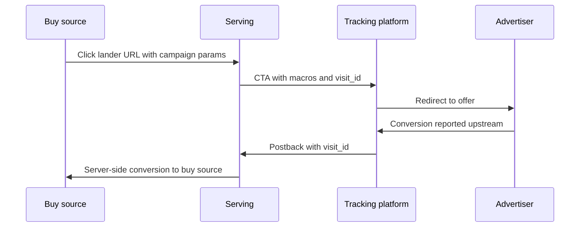

# Nexus Conversion Destinations

## 1. Purpose

Define how Nexus lets teams save **multiple conversion destinations per workspace** (each with a **`destinationId`**), set **one workspace `defaultDestinationId`**, require each **lander to select at most one** catalog entry (or inherit the default) before publish, how **Base** resolves that into a single **`conversionDestination`** on **Serving** lander sync, and how **`conversion_id`** maps to Meta **`event_id`**.

---

## 2. Problem Statement

- Today, conversions can be **ingested** (e.g. MAX → postback endpoint → `nexus.raw.conversions`) and **attributed** in the metric system by joining on `visit_id`.
- **MAX cannot fire a single conversion to both Nexus and the buy-side platform with two different primary IDs:** Nexus attribution is keyed on **`visit_id`**, while Meta optimization expects **`fbclid`** / cookie-derived signals; MAX historically supports **one id per conversion** for that fire path, so the partner cannot simultaneously post the same conversion to both systems on **different** unique keys without a **relay** on our side (postback with `visit_id` → we fire CAPI using data from `visit_served`).
- Publishers need **configurable firing to the buy source** (Meta CAPI first; Google, Taboola, others later) **without** re-entering the same credentials on **every new lander**.
- **Serving** only knows **`landerId` / `variantId`** — not **workspace**. **Base** resolves workspace catalog + **`defaultDestinationId`** + lander **`selectedDestinationId`** into one **`conversionDestination`** and sends it on **`PUT /landers`**.

---

## 3. Goals

| ID | Goal |
|----|------|
| G1 | **At most one active resolved `conversionDestination` per lander** — the user **must pick exactly one** catalog row (`selectedDestinationId`) or **inherit the workspace default** (`defaultDestinationId`) **before publish** when policy requires buy-side firing; otherwise publish is blocked. |
| G2 | **Workspace** stores a **catalog** of destination rows (each has its own **`destinationId`**). **Exactly one** row is the workspace default: **`defaultDestinationId`** points at that row’s id (not a per-row flag on every row). **Lander** stores **`selectedDestinationId`** (nullable = inherit default) plus optional field overrides. |
| G3 | On **Base → Serving** lander sync, Base sends the **resolved single `conversionDestination` object** on the lander payload so dispatch can fire using **`landerId`** only. |
| G4 | **Meta CAPI `event_id`** = our **`conversion_id`** assigned at postback ingest (same string on retries for deduplication). |
| G5 | **Core metric ingest** (`nexus.raw.conversions`, Flink enrichment, StarRocks rollups) **unchanged** unless product adds **dispatch observability** (optional; see §11). |

---

## 4. Non-goals (v1)

- Replacing core attribution in StarRocks.
- Changing the rule that **postbacks must carry a resolvable `visit_id`**.
- Storing long-lived **plaintext** access tokens on Serving or in the synced `conversionDestination` JSON (secret refs / vault handles only).

---

## 5. Definitions

| Term | Meaning |
|------|---------|
| **Conversion postback** | Server-side call from partner/advertiser pipeline (e.g. MAX) into our ingest endpoint with `visit_id`, `conversion_type`, value, currency, timestamp, `external_id`, etc. |
| **`conversion_id`** | Unique id **we assign** when the postback is first accepted (ULID or equivalent). Used as idempotency and **as Meta CAPI `event_id`** (see §7). |
| **Workspace destination row** | One saved row in the workspace catalog: **`destinationId`**, display name, **`buy_source`**, pixel/customer ids, **secret refs**, event maps, test codes, etc. Many rows per workspace. |
| **`defaultDestinationId`** | **Workspace-level** pointer to **one** catalog row’s **`destinationId`** — the default used for new landers when **`selectedDestinationId`** is null. |
| **`selectedDestinationId`** | **Lander-level** pointer to a catalog row; if null, Base resolves using **`defaultDestinationId`**. |
| **`conversionDestination`** (synced) | **One** resolved JSON object on the **Serving lander** row and on **Base → Serving `PUT /landers`**: the **effective** config after resolving **`selectedDestinationId`** (or default) + overrides. **No plaintext secrets.** |

---

## 6. End-to-end flow (four parties)

Same four lifelines as a **single** sequence: click path first, then conversion path on the **same** participants (reference style: one diagram, linear time top to bottom).

**Forward:** Buy source → Serving → Tracking platform → Advertiser. **Return:** Advertiser → Tracking platform → Serving → Buy source.

Product-level only: postback ingest, Kafka, and dispatch worker are **collapsed** into **Serving** and **Buy source** arrows.



**Attribution key:** **`visit_id`** remains the join key from postback to `visit_served` (see [design-decisions.md](../01-architecture/design-decisions.md) and [metric-collection.md](../05-metric-collection/metric-collection.md#attribution-model)).

**Implementation note:** **`Trk->>Srv`** is the MAX → Nexus postback; **`Srv->>Buy`** is dispatch (CAPI / Google / …) using **`visit_served`** + lander **`conversionDestination`**.

---

## 7. Meta CAPI: `event_id` and `conversion_id`

[Meta documents `event_id` for deduplication](https://developers.facebook.com/docs/marketing-api/conversions-api/deduplicate-pixel-and-server-events) between Pixel and server, and for **retry safety**.

**Product rule (v1):**

> **`event_id` in the Meta CAPI payload MUST equal `conversion_id`** — the identifier assigned by our postback ingest when the conversion is first accepted and written to Kafka.

**Consequences:**

- Retries or duplicate delivery of the **same** postback must reuse the **same** `conversion_id` so Meta deduplicates correctly (ingest should return the same `conversion_id` for idempotent replays when a stable partner idempotency key exists, e.g. `logid` / `external_id` — exact rule owned by postback service).
- Browser Pixel + CAPI dedup (if both exist) is out of scope unless we also own the browser event id; document as follow-up.

### 7.1 Sample Meta CAPI request (illustrative)

**`event_id`** below should be the ingest-time **`conversion_id`**.

```json
{
  "data": [
    {
      "event_id": "<conversion_id_from_ingest>",
      "user_data": {
        "fbc": "fb.1.1775171734000.IwY2xjawQph_lleHRuA2FlbQEwAGFkaWQBqy5VvcFOtnNydGMGYXBwX2lkDzI0NTc5MDgxODk1NTg2OAABHm_CJl21FgU-NO8bN_Q4SSitlrCnzhmJ5AH5gy6AFv9fXDKt5Oz_vQxHjM0W_aem_uOnKz81FaV_7oJyUaTrVsw",
        "client_ip_address": "107.21.28.235",
        "client_user_agent": "Mozilla/5.0 (compatible; example)"
      },
      "event_name": "Lead",
      "event_time": 1775171935,
      "action_source": "website"
    }
  ]
}
```

**Mapping from visit:** `fbc` / `fbp` / `fbclid` / `client_ip_address` / `client_user_agent` are sourced from **`visit_served`** (see [macros.md](macros.md)). Dispatch must follow Meta hashing and consent rules.

---

## 8. Where `conversionDestination` is stored (Base vs Serving)

### 8.1 Base System

| Location | What is stored |
|----------|----------------|
| **Workspace — catalog** | Many rows; **each row** has a unique **`destinationId`** (row primary key), display name, **`buy_source`**, **`fb_pixel_id`** / Google ids as applicable, **`access_token`** only as **secret ref** in DB, default **`action_source`**, currency rules, **`conversion_type` → event name** map, test codes, etc. |
| **Workspace — default** | **`defaultDestinationId`**: points to **one** catalog row’s **`destinationId`**. That row is the **default** for new landers when the lander has not chosen another row. It is **not** duplicated on every catalog row — it is a **single pointer** on the workspace. |
| **Lander (Base)** | **`selectedDestinationId`**: nullable. If **null**, Base resolves the effective row using **`defaultDestinationId`**. If **set**, it must equal a catalog **`destinationId`**. Optional per-field overrides. **Publish is blocked** when policy requires buy-side firing but neither default nor selection resolves to a valid row. |

On **publish / sync to Serving**, Base **resolves** `selectedDestinationId` or default → catalog row → overrides into **one** JSON object (**§9**) and sends it as **`conversionDestination`** on **`PUT /landers`** (same release window as variant sync; see variant flow in product diagrams — lander metadata can ship with or adjacent to **`PUT /variants`** in the pipeline).

### 8.2 Serving sync

- **`PUT /landers`** / **`GET /landers`** include **`conversionDestination`** with lander metadata. **Serving has no workspace** tables.
- Variants / HTML continue on **`PUT /variants`**; the publish pipeline still lands both in the same release window.

### 8.3 Serving database

| Store | Table | Column |
|-------|--------|--------|
| MS SQL (Renderly / A360) | **`dbo.A360_RENDERLY_LANDER`** | **`conversion_destination`** — `NVARCHAR(MAX)` or **`JSON`**; nullable when disabled. |

See [models.md — `A360_RENDERLY_LANDER`](models.md#2-a360_renderly_lander).

---

## 9. Resolved object and provider field sets

Synced **`conversionDestination`** is **one** object. It includes **`buy_source`** — which buy-side stack to fire into (`facebook`, `google`, `taboola`, …). Dispatch picks the adapter from **`buy_source`** (not a separate abstract `type`).

Values below are the **fields the dispatch layer must populate or read** when firing; some come from **config** (synced JSON / catalog row), some from **`visit_served`**, some from the **conversion postback**.

### 9.1 Facebook — Meta CAPI (`buy_source: facebook`)

| Field | Role | Typical source |
|-------|------|----------------|
| `fb_pixel_id` | Dataset / pixel target | Catalog row / `conversionDestination` config |
| `access_token` | Auth to Graph API | **Resolved at dispatch** from `secretRef` (never plaintext on lander row) |
| `action_source` | CAPI `action_source` | Config default (e.g. `website`); override if product allows |
| `currency` | ISO 4217 for value | Postback / conversion payload |
| `fbc` | Click cookie string | `visit_served` / request macros |
| `fbp` | Browser id cookie | `visit_served` |
| `event_time` | Unix seconds for the event | Conversion timestamp (normalized) |
| `event_id` | Deduplication id | **Must equal `conversion_id`** from ingest |
| `client_user_agent` | `user_data` | `visit_served` |
| `client_ip_address` | `user_data` | `visit_served` (privacy policy applies) |
| `conversion_type` | Internal taxonomy | Postback; mapped to Meta **`event_name`** (e.g. `lead` → `Lead`, `purchase` → `Purchase`, `ViewContent`, …) via catalog **`eventMap`** |
| `conversion_value` | Monetary amount | Postback as **float**; sent in CAPI `custom_data.value` where applicable |

### 9.2 Google — offline / upload-style conversion (`buy_source: google`)

Same pattern: **config** vs **visit** vs **postback**. Illustrative field set (exact API version TBD with engineering):

| Field | Role | Typical source |
|-------|------|----------------|
| `customer_id` | Google Ads customer id | Catalog / `conversionDestination` config |
| `conversion_action_id` | Resource name or id for the conversion action | Catalog / config |
| `access_token` or `refresh_token` | OAuth to Google Ads API | **Resolved at dispatch** from `secretRef` only |
| `gclid` | Click id | `visit_served` / URL param |
| `gbraid` / `wbraid` | iOS / web alternatives | `visit_served` when present |
| `conversion_time` | When conversion occurred | Postback / normalized timestamp |
| `conversion_value` | Amount | Postback **float** |
| `currency_code` | ISO 4217 | Postback |
| `order_id` / `external_attribution_id` | Idempotency / dedup with Google | Prefer stable id from postback (`external_id` / `conversion_id` per Google spec) |
| `consent` / consent-related flags | Where required by API | `visit_served` / CMP |

**Note:** Google field names and required shapes follow [Google Ads conversion upload](https://developers.google.com/google-ads/api/docs/conversions/upload-clicks) (or successor); this table is the **product contract** for what we must thread from config + visit + postback.

---

## 10. System responsibilities

| System | Scope |
|--------|--------|
| **Nexus UI** | Workspace **catalog** (many rows, each **`destinationId`**); set **`defaultDestinationId`**; lander **`selectedDestinationId`** + publish gate; test mode. |
| **Base** | Catalog + default + lander selection; **resolve** to **`conversionDestination`**; **`PUT /landers`**; RBAC / audit. |
| **Serving sync** | Persist **`conversionDestination`** ([OpenAPI](openapi.yaml)); no secrets in plaintext. |
| **Postback + dispatch** | `conversion_id`; Kafka; async fire to buy source (Serving org). |
| **Metric / StarRocks** | Unchanged for v1 core path; optional dispatch log (§11). |

---

## 11. Metric platform (F): optional observability

**Default:** no schema change to core conversion facts.

**Optional:** append-only dispatch outcomes for dashboards.

---

## 12. CTA and macro requirements

CTA / tracking URLs must carry **`{{visit_id}}`** and buy-side ids as needed ([macros.md](macros.md)). QA blocks publish if policy requires firing but **`visit_id`** is missing from outbound URLs.

---

## 13. Security and compliance

- Secrets in **vault** only; synced JSON uses **refs**; **`access_token`** never stored plaintext on **`A360_RENDERLY_LANDER.conversion_destination`**.
- GDPR / consent: use `visit_served` / CMP signals where required before firing.

---

## 14. Rollout

1. Workspace destination catalog + **`defaultDestinationId`** + lander **`selectedDestinationId`** + **`conversionDestination`** on **`PUT /landers`** + `conversion_destination` column.  
2. Meta CAPI path.  
3. Google / Taboola behind flags.  
4. Optional dispatch observability (§11).

---

## 15. Open questions

- Canonical postback idempotency key for stable `conversion_id` replay.  
- Variant-level destination overrides: v1 or later?  
- **`action_source`** default vs derived (in-app browser, etc.).

---

## 16. Document control

| Version | Date | Notes |
|---------|------|------|
| 0.1 | 2026-05-15 | Initial |
| 0.2 | 2026-05-15 | Rename field; four-party diagrams |
| 0.3 | 2026-05-15 | Workspace catalog + lander pick-one publish gate; Facebook/Google field tables; Related at end |
| 0.4 | 2026-05-15 | Title **Nexus Conversion Destinations**; merged four-party diagram; **`destinationId`** / **`defaultDestinationId`** / **`selectedDestinationId`**; **`buy_source`** instead of type discriminator |

---

## Related documentation

- [Serving API](api.md)  
- [Serving entity definitions](serving-entity-definitions.md)  
- [Macros](macros.md)  
- [Metric Collection — conversion postbacks](../05-metric-collection/metric-collection.md#1c-conversion-postbacks--postback-endpoint)  
- [Design decisions — attribution](../01-architecture/design-decisions.md)  
- [OpenAPI — `LanderUpsertRequest`](openapi.yaml#/components/schemas/LanderUpsertRequest)  
- [Physical model — `A360_RENDERLY_LANDER`](models.md#2-a360_renderly_lander)

[← Back to Serving API](api.md) · [Macros](macros.md) · [Metric Collection](../05-metric-collection/metric-collection.md)
